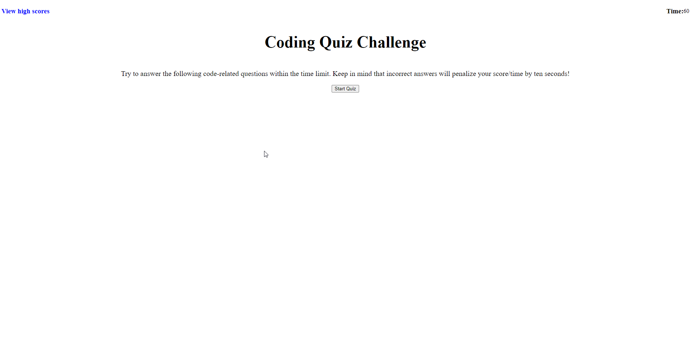

# Description

The goal for this challenge is to create a timed quiz that will ask user code-related questions. The user has 60 seconds to complete the quiz. This quiz includes multiple choice questions. At any point, if the user selects an incorrect answer, the timer will reduce by 10 seconds. The goal is to answer as many questions correctly within 60 seconds. Users score will be stored in the browswer so they can gauge progress against other players. 

Here is the link to my page: https://aliyajeylani.github.io/Code_quiz_app/

# Installation

N/A

# Usage

Here is the link to my github repository: https://github.com/aliyajeylani/Code_quiz_app

# Credits

N/A

# License 

N/A
